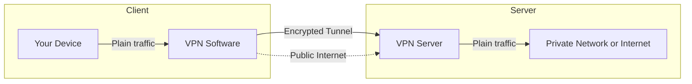
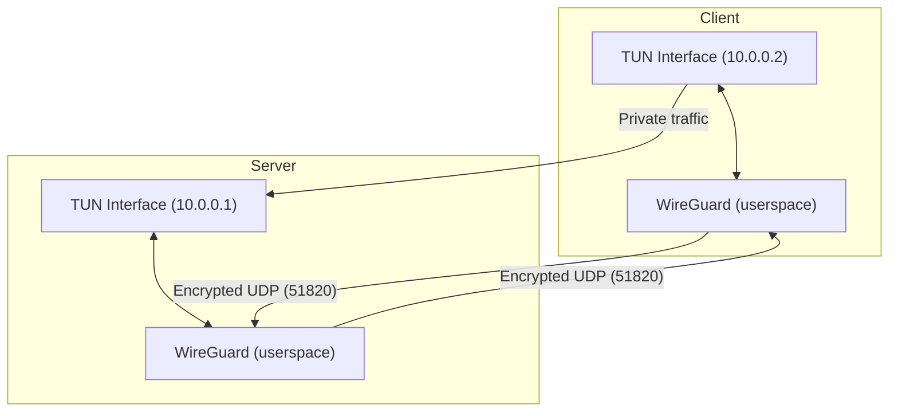

# SimpleVPN: Your Minimal, Modern, and Hackable WireGuard VPN in Go!

Are you ready to take control of your privacy, learn about modern VPN technology, and hack on a real-world networking project? Meet **SimpleVPN**—a minimal, developer-friendly VPN server and client built in Go, powered by the blazing-fast and secure WireGuard protocol!

---

## 🌐 How Do VPNs Work? (A Quick Primer)

A **Virtual Private Network (VPN)** is a technology that creates a secure, encrypted connection—called a "tunnel"—between your device and another network (often the internet, or a private network at your office or home). Here’s what happens under the hood:

- **Tunneling:** VPNs use special network interfaces (like TUN/TAP devices) to capture your network traffic and wrap it in an encrypted "envelope." This envelope is sent over the public internet to a VPN server.
- **Encryption:** All data inside the tunnel is encrypted, so even if someone intercepts your traffic, they can’t read it.
- **Authentication:** Both client and server use cryptographic keys to prove their identity and establish trust.
- **Private Networking:** Once the tunnel is established, your device acts as if it’s on the same local network as the VPN server. You can access private resources, mask your IP address, and browse securely—even on public Wi-Fi.
- **Protocols:** There are many VPN protocols (OpenVPN, IPSec, WireGuard, etc.). WireGuard is the newest, focusing on simplicity, speed, and strong modern cryptography.

**In short:** A VPN lets you send your data through a secure, private tunnel—protecting your privacy and giving you access to remote networks as if you were physically there.

---

### VPN Tunnel: High-Level Architecture



---

## 🚀 Why SimpleVPN?

- **Zero Bloat, All Power:** SimpleVPN is designed to be as simple as possible, but no simpler. It gives you the core of a WireGuard VPN—no more, no less. Perfect for learning, hacking, and extending.
- **Pure Go, Pure Fun:** No need for external binaries for key generation or configuration. Everything is handled in Go, making it portable and easy to understand.
- **Automatic Key Management:** The server generates and stores its own keys in a `.simplevpn` directory. No more manual key wrangling!
- **Embedded WireGuard:** The VPN tunnel is managed directly in Go using the userspace WireGuard implementation. No shelling out, no magic—just code you can read and modify.
- **Cross-Platform:** Works on Linux and macOS, with a focus on developer experience and hackability.
- **Configurable and Extensible:** Want to add a REST API, a web UI, or dynamic peer management? The codebase is small and clean—fork away!

---

## 🗂️ Project Breakdown

**Project Structure:**

```
simplevpn/
  main.go        # The VPN server (embedded WireGuard, key management, TUN setup)
  client.go      # The VPN client (config generator & embedded mode)
  Makefile       # Build automation
  README.md      # Documentation
  ARCHITECTURE.md# High-level design
  blog.md        # This blog post!
```

- **main.go:** Handles server-side key generation, TUN device setup, WireGuard device management, and prints the public key for clients.
- **client.go:** Can generate a WireGuard config for use with `wg-quick` or run as an embedded client, configuring the peer programmatically.
- **.simplevpn/**: Stores the server's private and public keys securely.

---

## ⚙️ How Does SimpleVPN Work?

### Server Flow
1. **Key Management:**
   - On first run, the server generates a Curve25519 keypair and saves it in `.simplevpn/`.
   - The public key is printed for client configuration.
2. **TUN Device Setup:**
   - The server creates a TUN interface (e.g., `utun` on macOS) and assigns it an internal IP (e.g., `10.0.0.1`).
3. **WireGuard Device:**
   - The server brings up a WireGuard device in userspace, ready to accept connections from clients.
4. **Peer Management:**
   - Currently, peers (clients) must be configured manually or by extending the code.

### Client Flow
1. **Config Generation Mode:**
   - Generates a WireGuard keypair and outputs a config file for use with `wg-quick`.
   - The user fills in the server’s public key and endpoint.
2. **Embedded Mode:**
   - Sets up a TUN interface and assigns an internal IP (e.g., `10.0.0.2`).
   - Uses the `wgctrl-go` library to programmatically configure the WireGuard peer (server) with the provided public key and endpoint.
   - Brings up the WireGuard tunnel in-process, ready to send encrypted traffic to the server.

### Data Flow
- All traffic between client and server is encrypted using WireGuard’s modern cryptography.
- The server and client communicate over UDP (default port 51820).
- The TUN interfaces on both sides make the VPN traffic appear as if it’s on a private network.

---

## 🖼️ Architecture Diagram



---

## 🛠️ Technical Highlights

- **Automatic Key Generation:** On first run, the server creates a Curve25519 keypair and stores it in `.simplevpn`. The public key is printed for easy client setup.
- **Embedded WireGuard Tunnel:** Both server and client can run a WireGuard tunnel in-process, using Go libraries for TUN device management and configuration.
- **No External Dependencies:** Key generation, interface setup, and peer configuration are all handled in Go. No need for the `wg` or `ip` binaries (except for interface IP assignment, which is handled via standard system tools).
- **Flexible Client:** The client can generate configs for use with `wg-quick` or run as an embedded tunnel, configuring peers programmatically.
- **Simple, Readable Code:** The codebase is intentionally minimal, making it perfect for learning, teaching, or rapid prototyping.

---

## ✨ Why This Is Cool

- **Learn by Doing:** Want to understand how VPNs work under the hood? SimpleVPN is your playground.
- **Privacy for Hackers:** Build your own VPN, audit every line, and know exactly what your code is doing.
- **Extend and Share:** Add features, build a dashboard, or integrate with your own authentication system. The sky’s the limit!
- **Great for Demos and Labs:** Need a VPN for a hackathon, a demo, or a private network? Spin up SimpleVPN in minutes.

---

## 🏁 Getting Started

1. **Clone the repo and build:**
   ```sh
   git clone <your-repo-url>
   cd simplevpn
   make build
   ```
2. **Run the server:**
   ```sh
   sudo ./bin/simplevpn-server
   # On first run, your server public key will be printed!
   ```
3. **Run the client:**
   ```sh
   ./bin/simplevpn-client --server-ip=<server-ip> --server-port=51820 --server-pubkey=<server-public-key>
   ```
4. **Connect and enjoy secure, private networking!**

---

## 🔮 Future Improvements

SimpleVPN is intentionally minimal, but there are many exciting directions for future development:

- **Dynamic Peer Management:** Add a REST API or CLI to add/remove clients on the fly, making it easy to manage users.
- **Web UI:** Build a dashboard for monitoring connections, managing peers, and viewing logs.
- **Automated IP Assignment & DHCP:** Integrate a small DHCP server so that clients can automatically discover and obtain their internal VPN IP addresses, making onboarding seamless and reducing manual configuration.
- **Multi-Platform Support:** Extend support to Windows and other platforms.
- **Cloud/Container Deployments:** Add Helm charts, Dockerfiles, or cloud-init scripts for easy deployment.
- **Authentication & Authorization:** Integrate with OAuth, LDAP, or other identity providers for secure access control.
- **Monitoring & Metrics:** Add Prometheus metrics, logging, and alerting for production use.
- **Mobile Client:** Build a mobile app or provide easy integration with mobile WireGuard clients.
- **Advanced Routing:** Support split tunneling, custom routes, and multi-hop VPNs.

---

## 🙌 Join the Fun!

SimpleVPN is open source and ready for your ideas. Fork it, star it, and share what you build. Whether you’re a privacy enthusiast, a Go developer, or just VPN-curious, SimpleVPN is your ticket to the world of modern, hackable VPNs.

**Happy tunneling!** 